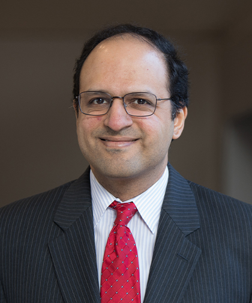

## Vagish Hemmige

I work at the intersection of **infectious diseases** and **transplantation**, with a focus on **HIV care & prevention**, **HIV-to-HIV thoracic transplantation**, and building open, reproducible **R** workflows for large healthcare datasets.

I’m based in the **Bronx, New York**. Day to day, I split time between patient care, program building, and collaborative research—especially projects that improve access to transplant for people living with HIV and make complex data usable by clinical teams.

---

## What I’m working on

- **Transplant & HIV:** advancing pathways for HIV-positive donor thoracic transplants and sharing practical “how-to” resources for new programs.
- **Reproducible analytics in R:** extensive experience using R to analyze clinical data.
- **Education:** clinical reasoning, and bringing data skills to clinicians with approachable examples.

---

## Education & Training

- **MS, Health Sciences**
  - University of Chicago, 2010-2014
- **Fellowship, Infectious Diseases**
  - University of Chicago, 2009-2012
- **Residency, Internal Medicine**
  - University of Chicago, 2006-2009
- **MD**
  - NYU School of Medicine, 2002-2006
- **BA, Physics**
  - Harvard College, 1998-2002

---

## Open-source projects

- **sRtr** — R helpers for working with UNOS/SRTR transplant data  
  <https://vagishhemmige.github.io/sRtr/>

- **strobe** — STROBE-style inclusion/exclusion tracking for observational studies  
  <https://vagishhemmige.github.io/strobe/>

- **usRds** *(in progress)* — utilities for loading, labeling, and converting USRDS claims files to Parquet with schema-aware helpers.

---

## Selected interests & methods

- **Clinical:** transplant ID, opportunistic infections, HIV prevention & primary care  
- **Research:** HIV and thoracic transplant, big data work with the SRTR and UNOS  
- **Teaching:** have taught clinical infectious diseases to trainees as well as statistics and epidemiology.

---

## Speaking & teaching

I enjoy guest lectures, workshops, and small-group sessions on:

- Practical R for clinicians and researchers
- Epidemiology and biostatistics
- Transplant ID topics (HIV D+/R+ programs, protocols, safety)

---

## Mentoring

I have mentored trainees in case reports, clinical research, and big data/research methods.

I am open to mentoring trainees and faculty at other institutions who are interested in working with big data sets such as the USRDS or the SRTR and performing their own analyses in R.  While a remote trainee would need to obtain their own copy of the data, Github would enable collaboration on the analysis code.

---

## Contact & links

- **Faculty profile:** <https://einsteinmed.edu/faculty/15768/vagish-hemmige>  
- **Physician profile:** <https://doctors.montefioreeinstein.org/providers/1205162245/vagish-s-hemmige>  
- **GitHub:** <https://github.com/VagishHemmige>  
- **ORCID:** <https://orcid.org/0009-0006-6346-1826>
